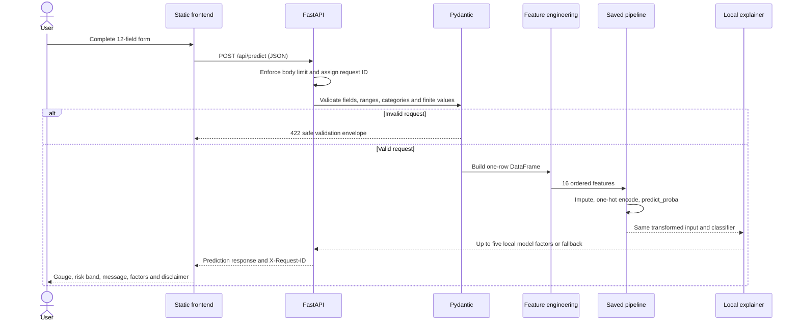
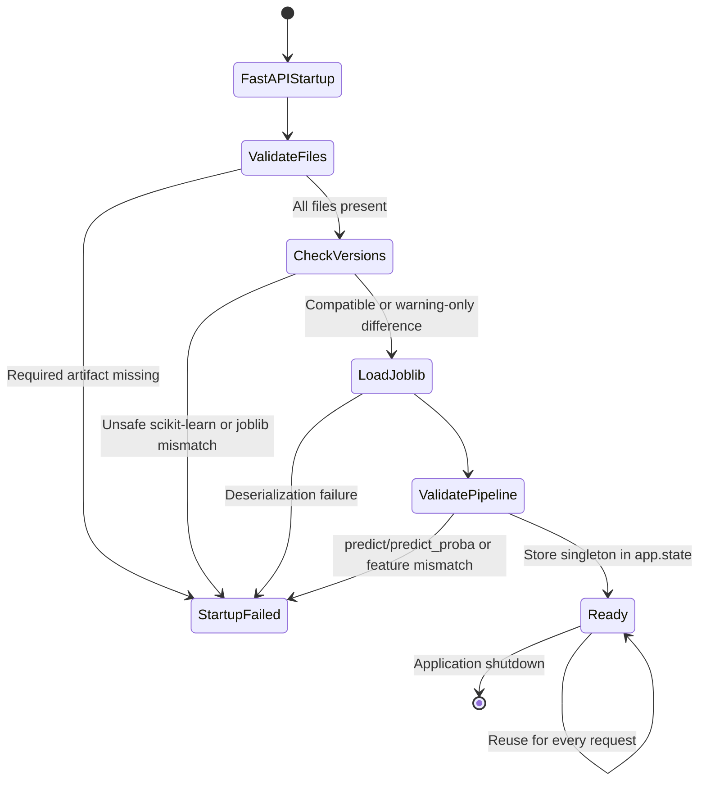
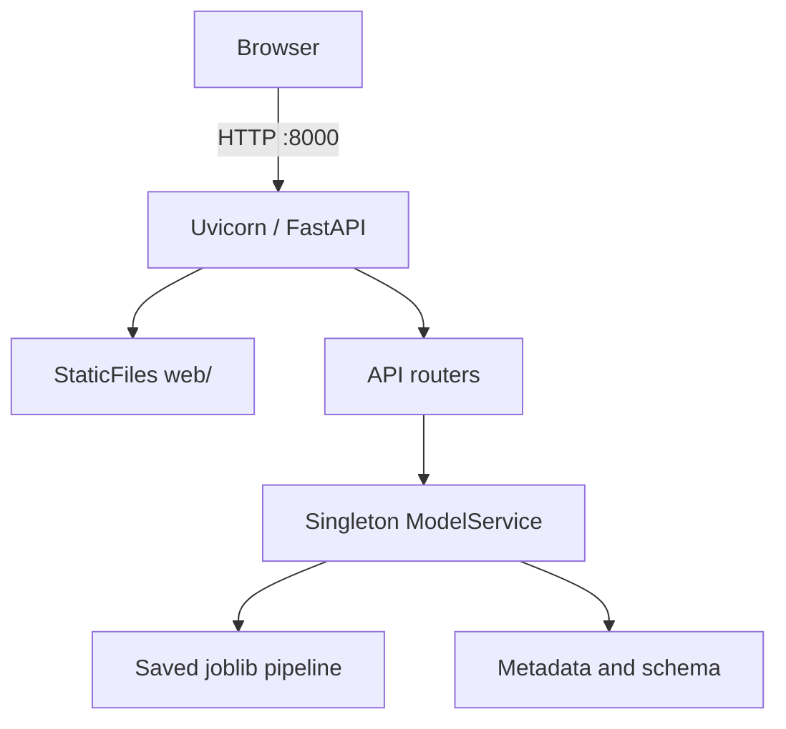

# SmartHabit architecture

## System scope

SmartHabit separates the offline competition workflow from online inference. Training and evaluation remain evidence in the notebook, result files, and saved model. The running application never retrains the model; it loads only the trusted local pipeline and audited metadata.

## Training versus inference

```mermaid
flowchart LR
    subgraph Offline[Offline training and evaluation]
        A[Competition train.csv] --> B[Notebook data checks and analysis]
        B --> C[add_domain_features]
        C --> D[Stratified 80/20 split]
        D --> E[Pipeline preprocessing]
        E --> F[Model comparison]
        F --> G[Three-fold stratified cross-validation]
        G --> H[Final LightGBM pipeline fit]
        H --> I[smartphone_addiction_model.joblib]
        H --> J[model_metadata.json]
        H --> K[environment.json]
    end

    subgraph Online[Online inference]
        L[Browser or API client] --> M[FastAPI validation]
        M --> N[Shared add_domain_features]
        N --> O[Saved preprocessing pipeline]
        O --> P[Saved LightGBM classifier]
        P --> Q[Probability, risk band and local factors]
        Q --> L
    end

    I --> O
    J --> M
    K --> R[Startup compatibility checks]
    R --> O
```

### Offline training architecture

The executed notebook:

1. loads the Kaggle competition data;
2. excludes `id` from prediction features;
3. creates the same four domain features now shared in `src/feature_engineering.py`;
4. uses a stratified 80/20 train-validation split with `random_state=42`;
5. compares Logistic Regression, Random Forest, LightGBM, and MLP models;
6. validates selected candidates with three-fold `StratifiedKFold`, shuffling, and `random_state=42`;
7. fits the final LightGBM pipeline on 691,369 rows; and
8. saves the complete preprocessing/classifier pipeline plus metadata and environment evidence.

The official metric is ROC AUC. The recorded LightGBM holdout score is `0.9597828493169706`; the three-fold mean is `0.9603813961948449` with standard deviation `0.00048523207515390994`.

### Online inference architecture

The API accepts only the 12 raw fields. The shared function appends four engineered columns in training order. The saved pipeline then performs its fitted numeric/categorical preprocessing and LightGBM prediction. This prevents the frontend or API from independently recreating fitted preprocessing.

## Application components

| Component | Responsibility |
|---|---|
| `web/` | Accessible static pages, dynamic schema-based form, API calls, result gauge, factor display |
| `api/main.py` | FastAPI construction, lifespan, middleware, API routers, static mount |
| `api/config.py` | Environment-backed validated settings |
| `api/model_loader.py` | Required-file checks, package compatibility, trusted singleton loading, schema checks |
| `api/schemas.py` | Pydantic request/response contracts and bounds |
| `api/predictor.py` | DataFrame construction, feature order, probability/class mapping, risk bands |
| `api/explainer.py` | Local LightGBM contribution generation and readable feature aggregation |
| `api/middleware.py` | Request body limit, UUID request IDs, headers, structured request logs |
| `api/exceptions.py` | Consistent safe JSON error responses |
| `src/feature_engineering.py` | Training-compatible deterministic feature engineering |
| `models/` | Trusted joblib model, metadata and recorded environment |

## Prediction request flow

The positive probability index is not assumed: the loaded model classes are checked against positive class `1` from `docs/model-schema.json`.

## Model-loading lifecycle

During FastAPI lifespan startup, `ModelService.load()`:

1. verifies the model, metadata, environment, and model-schema files exist;
2. parses JSON metadata safely;
3. compares the running Python/package versions with `models/environment.json`;
4. rejects unsafe scikit-learn or joblib mismatches;
5. deserializes only the trusted repository model;
6. confirms `predict`, `predict_proba`, metadata keys, and exact feature order; and
7. stores the loaded service once in `application.state.model_service`.

Routes receive this singleton through `get_model_service`. If it is unavailable, clients receive HTTP 503 rather than a per-request load attempt.

## Deployment architecture

The Docker configuration exposes one port, runs one Uvicorn worker so only one model copy is loaded, uses a non-root user, and mounts no raw training data. Compose applies a read-only root filesystem, a small temporary filesystem, and `no-new-privileges`.

## Reliability and security boundaries

- Only explicit HTTP(S) origins are accepted for CORS; wildcard configuration is rejected.
- Request bodies default to a 16,384-byte maximum.
- Logs include request ID, method, path, status, and duration, but exclude bodies and query strings.
- Responses include a request ID and defensive response headers.
- Validation errors do not echo submitted values.
- The model file is trusted local application data; user-uploaded serialized files are never accepted.
- The application has no authentication because it is a public educational tool and has no user-account functions.
